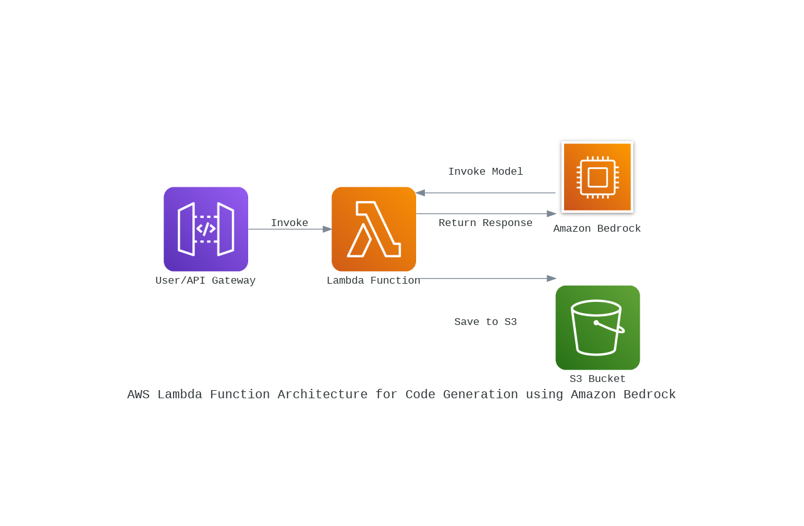
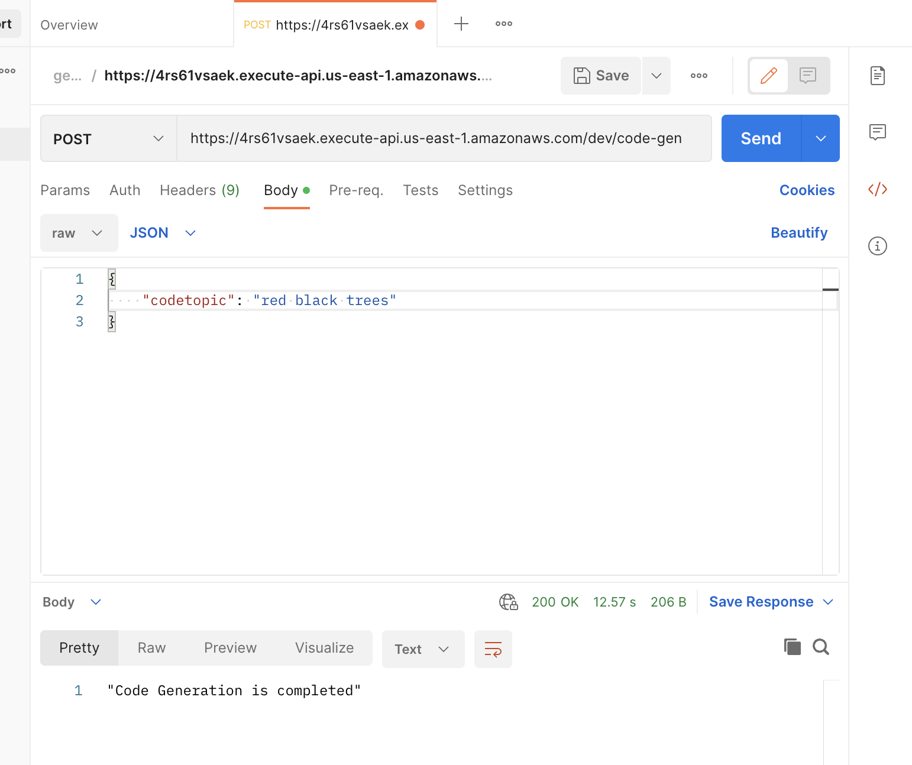
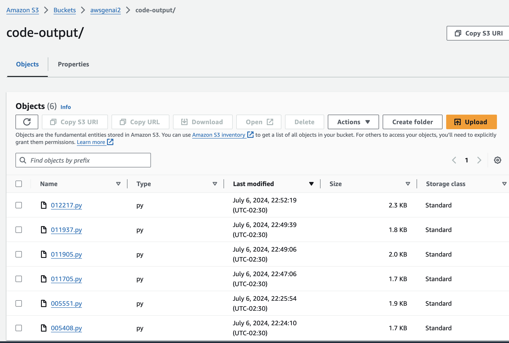

# AWS Lambda Function for Code Generation using Amazon Bedrock

This repository contains a Python-based AWS Lambda function that generates Python code snippets using the Amazon Bedrock service and saves the generated code to an S3 bucket. The function is triggered via an API Gateway endpoint, making it easy to integrate with various applications and services.

## Features

- **Code Generation**: Generates Python code snippets based on a given topic using Amazon Bedrock.
- **AWS Integration**: Utilizes AWS services such as Lambda, Bedrock, and S3.
- **Serverless Architecture**: Leverages the benefits of a serverless architecture for scalability and cost-efficiency.

## Architecture



## Prerequisites

- AWS account
- IAM role with necessary permissions
- S3 bucket
- Amazon Bedrock setup
- API Gateway setup

## Setup

### Step 1: Clone the repository

```bash
git clone https://github.com/yourusername/bedrock-code-generator.git
cd bedrock-code-generator
```

### Step 2: Configure AWS CLI

Ensure that you have the AWS CLI installed and configured with the appropriate permissions.

```bash
aws configure
```

### Step 3: Deploy the Lambda function

Deploy the Lambda function using the AWS Management Console or AWS CLI.

### Step 4: Set up API Gateway

Create an API Gateway endpoint to trigger the Lambda function. You can use the following configuration:

- **Method**: POST
- **Endpoint**: `/generate-code`
- **Integration**: Lambda Function

### Step 5: Update IAM Role

Ensure that your Lambda function's IAM role has the necessary permissions:

```json
{
    "Version": "2012-10-17",
    "Statement": [
        {
            "Effect": "Allow",
            "Action": [
                "bedrock:InvokeModel"
            ],
            "Resource": [
                "arn:aws:bedrock:us-east-1::foundation-model/meta.llama3-70b-instruct-v1:0"
            ]
        },
        {
            "Effect": "Allow",
            "Action": [
                "s3:PutObject"
            ],
            "Resource": [
                "arn:aws:s3:::your-s3-bucket-name/*"
            ]
        }
    ]
}
```

## Usage

### API Request

You can test the API using Postman or any other API testing tool. Here is an example request:

- **URL**: `https://your-api-gateway-endpoint/generate-code`
- **Method**: POST
- **Body**:

```json
{
  "codetopic": "sorting algorithms in Python"
}
```

### Response

The response will indicate whether the code generation and saving process was successful:

```json
{
  "statusCode": 200,
  "body": "Code Generation is completed"
}
```

## Screenshots

### Postman Request



### S3 Bucket



## Code Overview

### Lambda Function

```python
import boto3
import botocore.config
import json

from datetime import datetime

def code_generate_using_bedrock(codetopic:str)-> str:
    prompt=f"""<s>[INST]Human: Write a python code on {codetopic}
    Assistant:[/INST]
    """

    body={
        "prompt":prompt,
        "max_gen_len":512,
        "temperature":0.5,
        "top_p":0.9
    }

    try:
        bedrock=boto3.client("bedrock-runtime",region_name="us-east-1",
                             config=botocore.config.Config(read_timeout=300,retries={'max_attempts':3}))
        response=bedrock.invoke_model(body=json.dumps(body),modelId="meta.llama3-70b-instruct-v1:0")

        response_content=response.get('body').read()
        response_data=json.loads(response_content)
        print(response_data)
        code_details=response_data['generation']
        return code_details
    except Exception as e:
        print(f"Error generating the code:{e}")
        return ""

def save_code_details_s3(s3_key,s3_bucket,generate_code):
    s3=boto3.client('s3')

    try:
        s3.put_object(Bucket = s3_bucket, Key = s3_key, Body =generate_code )
        print("Code saved to s3")

    except Exception as e:
        print("Error when saving the code to s3")


def lambda_handler(event, context):
    # TODO implement
    event=json.loads(event['body'])
    codetopic=event['codetopic']

    generate_code= code_generate_using_bedrock(codetopic=codetopic)

    if generate_code:
        current_time=datetime.now().strftime('%H%M%S')
        s3_key=f"code-output/{current_time}.py"
        s3_bucket='awsgenai2'
        save_code_details_s3(s3_key,s3_bucket,generate_code)


    else:
        print("No code was generated")

    return{
        'statusCode':200,
        'body':json.dumps('Code Generation is completed')
    }
```

## License

This project is licensed under the MIT License. See the [LICENSE](LICENSE) file for details.

## Acknowledgements

- [AWS Lambda](https://aws.amazon.com/lambda/)
- [Amazon Bedrock](https://aws.amazon.com/bedrock/)
- [Boto3](https://boto3.amazonaws.com/v1/documentation/api/latest/index.html)
- [Postman](https://www.postman.com/)

---

Feel free to contribute to this project by submitting issues or pull requests. For major changes, please open an issue first to discuss what you would like to change.

Happy coding!
```
